## Semi-supervised

> 半监督学习(semi-supervised learning)
> 1、introduction
> 2、Semi-supervised Learning for Generative Model
> 3、Low-density Separation Assumption：非黑即白
> 4、Smoothness Assumption：近朱者赤，近墨者黑
> 5、Better Representation：去芜存菁，化繁为简

### Introduction

**Supervised和Semi-supervised的区别**

Supervised Learning : $\left\{ (x^r, \hat y^r) \right\}_{r=1}^R$

* E.g $x^r$ : image, $\hat y^r$ : class labels

Semi-supervised Learning : $\left\{ (x^r, \hat y^r) \right\}_{r=1}^R$ , 还有一组 $\{x^u\}_{u=R}^{R+U}$

* training data中，部分data没有标签，只有input $x^u$ 

* 通常情况下，无标签的数据远大于有标签的数据 **U >> R**

* 分为两种：Transductive Learning 和 Inductive Learning

  * Transductive Learning ：将test data当作unlabeled data

    适用于已知test data的情况。

    这里仅仅使用了 test data的 **feature** 而不是 **label**, 因此不算cheating

  * Inductive Learning ：不将 test data当作 unlabeled data

    在train的时候并不知道test data长什么样。

  **使用哪种取决于test data是否已知**

  

### Why Semi-Supervised Learning Helps?

>  有人常会说我们没有data，但是我们缺的只是有label的data. E.g  image我们可以轻易获得，但是给image
>
> 作标签才是难得

我们人类实际上也是一直在做supervised learning。小孩被父母告知一只是狗，后面一直动物是猫是狗就是他自己学习的。

**Why helps？**

> Unlabeled Data 虽然没有label，但他们的distribution会告诉我们一些事

semi-supervised learning使用unlabled data时往往伴随着一些假设，而半监督学习的效果就取决于assumption是否符合实际情况

我们凭直觉觉得猫下面的那个应该是猫，但是也可能是个狗，谁知道呢？

### Semi-supervised Learning for Generative Model

**Supervised Generative Model**

事实上，在监督学习中，我们已经讨论过概率生成模型了，假设class1和class2的分布分别为$mean_1=u^1,covariance_1=\Sigma$、$mean_2=u^2,covariance_2=\Sigma$的高斯分布，计算出Prior Probability后，再根据贝叶斯公式可以推得新生成的x所属的类别

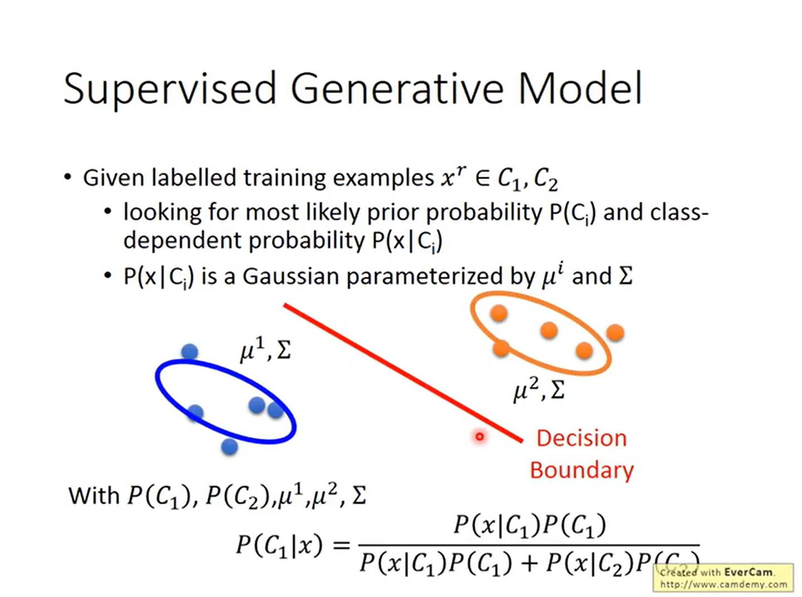

但是现在有了unlabeled data，我们的决定会有所改变。现在有了这些绿色的data，曾经的 $\mu_1, \Sigma_1$ 就不再合理了, 我们会认为圆形才是合理的分界线。同时我们会认为class2的数据较多，其 prority probabilty 更大。

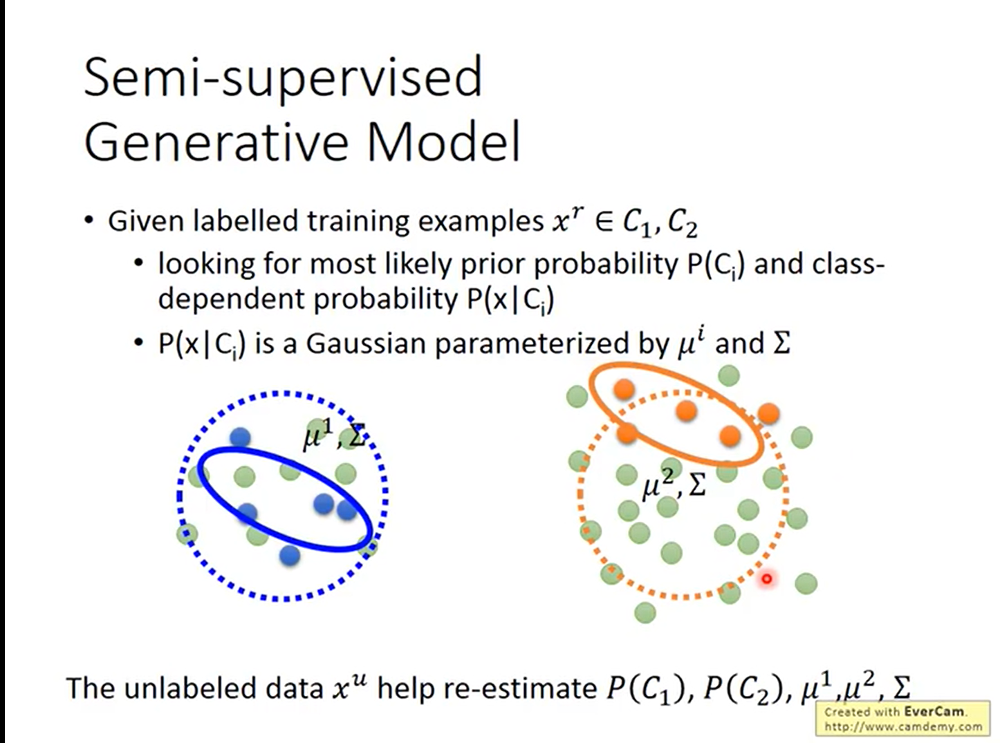

**如何 formulation ?**

1. 初始化参数 $\theta = \{P(C_1), P(C_2), \mu_1, \mu_2, \Sigma \}$ 

    可以random 可以用labled data估测

2. 计算每一笔unlabled data 的 posterior probabilty

   $P_{\theta}(C_1|x^u)$  ： 取决于 $\theta$

3. 更新模型

   **更新 P(C1)**

   原本没有unlabled data时， $P(C_1) = \frac{N_1}{N}$ 

   有unlabled data：$P(C_1) = \frac{N_1 + \sum_{x^u}P(C_1|x_u)}{N}$

   **更新 $\mu_1$ **

   在原本的基础上，加上 $x^u$ 的均值

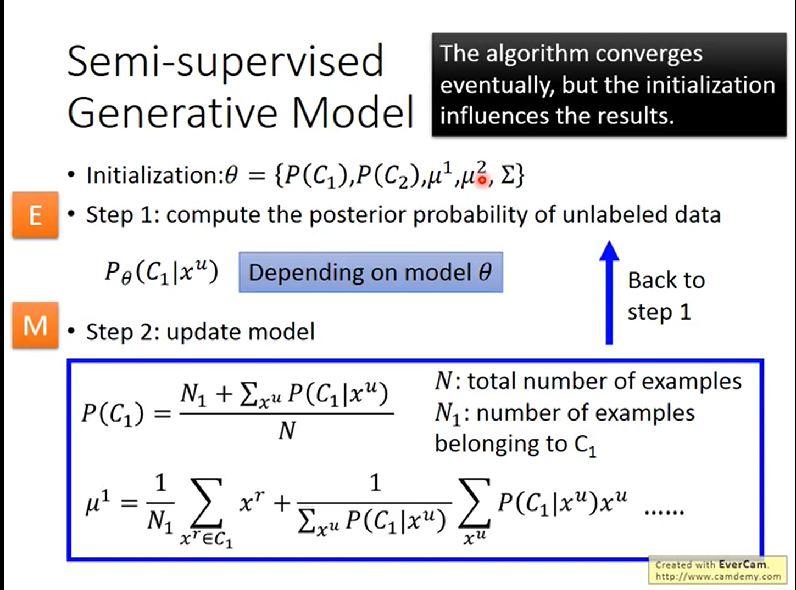

​		理论上这个方法一定会收敛，但是初始值会影响收敛

​		**实际上这个和EM算法非常像，step1对应E， step2对应了M**

​	**Why works? **

​	当我们只有labled data时，我们的目标是最大化似然函数

​	$logL(\theta) = \sum_{x^r}logP_\theta (x^r, \hat y^r ) , P_{\theta}（x^r, \hat y^r) = P_{\theta}(x^r|\hat y ^r) P(\hat y^r)$

​	把所有的likelihood加起来就是总的likelihood， **且有封闭解**

​	当有unlabled data时，我们并不知道unlabled data属于那个分类，因此每笔unlabled data的概率就时使用total probability公式得到的，因此我们的 最大化likelihood的函数就要加上 unlabled data的liklihood

​	$logL(\theta) = \sum_{x^r}logP_\theta (x^r, \hat y^r )  + \sum_{x^u} log(P_{\theta}(x^u)) $

​	**但是这个函数没有封闭解，我们只能iteratively地解。**

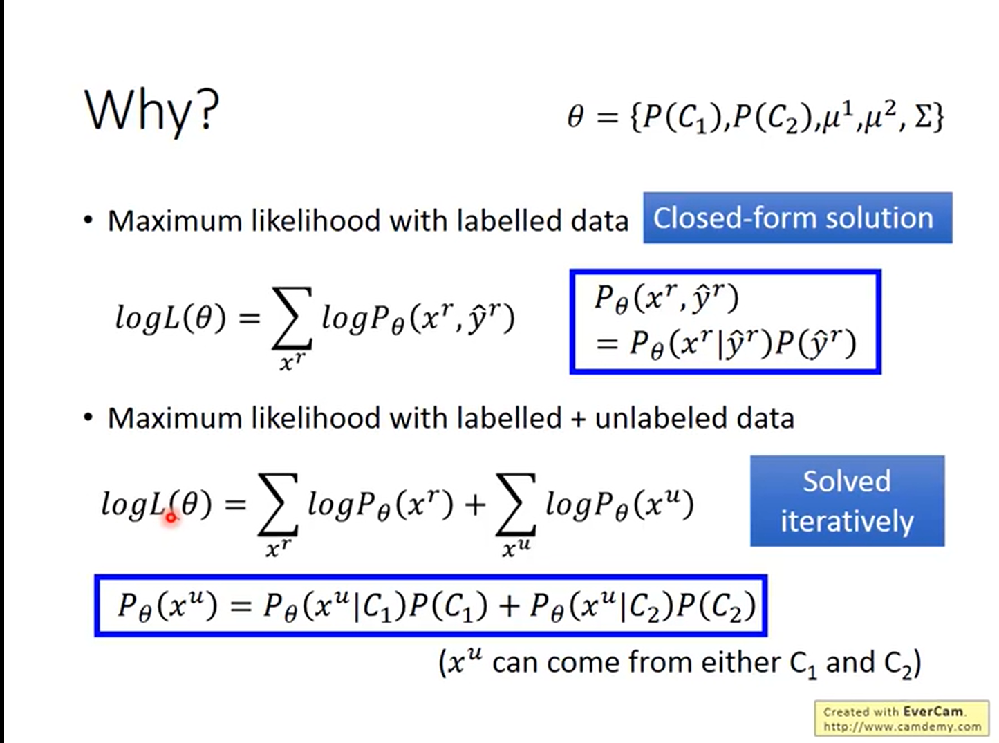

### Low-density Seperation

>世界是 **非黑即白的**， 即两个不同的类别的distribution有非常明显的分界线。交界线附近的data density是很低的

#### Self-training

我们有 labled data $\{(x^r, \hat y^r)\}$和unlabled data, $\{x^u\}$ 

我们重复以下步骤：

1. 使用 labelled data 训练出 f* 
2. 使用 f* 应用到 unlabeled data上，得到 $\{x^u, y^u\}$

3. 从unlabeled data中取出一部分放入labelled data中
4. 回头去训练 f*

至于怎么取出unlabeled data，我们可以给每笔data一个weight，类似于confidence

 Self-training 很直觉，但是我们能否用到regression上吗？

**当然没用！因为label是regression的结果，放回去训练有个腿子用**

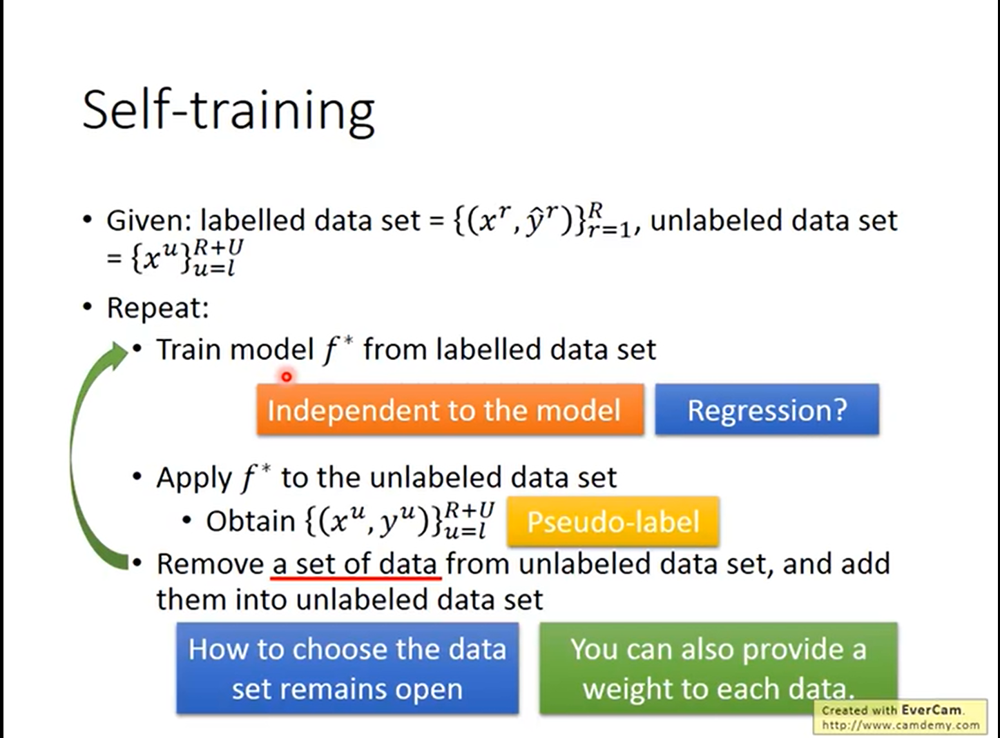

​	**self-training和semi for generative的区别**

​	self-training是hard label，即强制有一个label

​	 semi-supervised generative model 是soft label，给的是概率

​	如果我们使用的是neural network

​	我们有一笔 $x^u$,

* 如果使用hard，我们的new target变为  $\left[\begin{array}{l} 1 \\0 \end{array}\right]$

* 如果使用soft，70%属于class1, 30%属于class2, new target变为 $\left[\begin{array}{l} 0.7 \\0.3 \end{array}\right]$

  **第二个完全没有用！和Regression一个道理, 所以一定要用hard**

  实际上就是 low-density的概念，因为是非黑即白的，如果看着像 class1，那他就一定是class1，不可能是class2

#### Entropy-based Regularization

>  我们不想那么hard，可以考虑 Entropy-Based Regularization

我们得到的毕竟是个几率，我们希望几率是集中在一个类别上的，这才是符合low-density seperation的假设

如何用数字的方法来evaluate这个distribution是否是集中的呢？

使用Entropy

$E(y^u) = -\sum y_m^uln(y_m^u)$

* 当概率很集中时，Entropy很小
* 当概率很分散时，Entropy很大

因此我们可以重新设计 Loss Function。

原本的我们衡量Labelld data时使用cross-entropy来衡量误差

对于 Unlabeled data，我们可以加上一个entropy来衡量概率的分散程度。 

而两项误差通过一个weight连接起来吗，就类似之前的Regularization

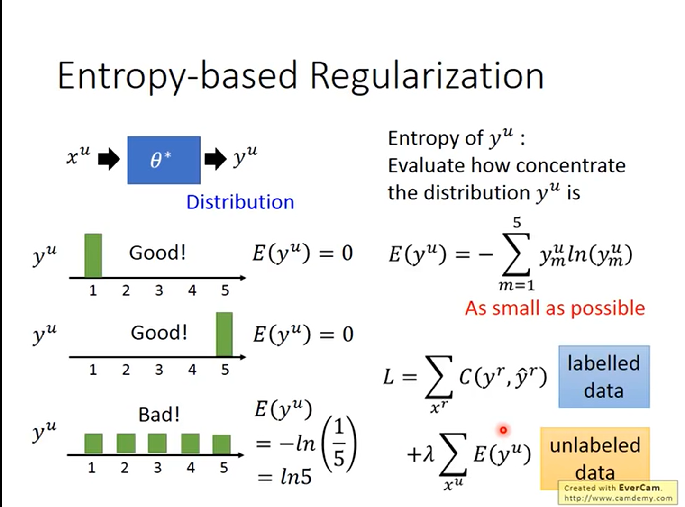

#### Semi-supervised SVM

SVM做的是找一个boundary，区分labelled data

Semi-supervised SVM 就是穷举所有labels for unlabeled data，对每一个可能做一个 SVM ( ? ? 那是指数级别的) ，然后找出来一个最好的。具体如何穷举和选最好的，看paper

### Smoothness Assumption

> 近朱者赤近墨者黑

#### Assumption

* 如果x很像，则拥有一样的y
* 更精确的来说
  1. x不是均匀分布的 -> 分布有的集中有的分散
  2. 如果 $x^1$ 和 $x^2$ 在一个high density的区域很相近，则 $\hat y^1 $ 和 $\hat y^2$  就一样

实际上就是说 x1和x2可以用一个 high density path进行连接起来

如图，图里有 x1, x2, x3. 但看图 x2和x3更近，但是我们可以看到 x1, x2中间有一大块high density，而 x2，x3中间却没什么数据，因此基于 Smoothness Assumption，我们认为 x1和x2会有相同的label

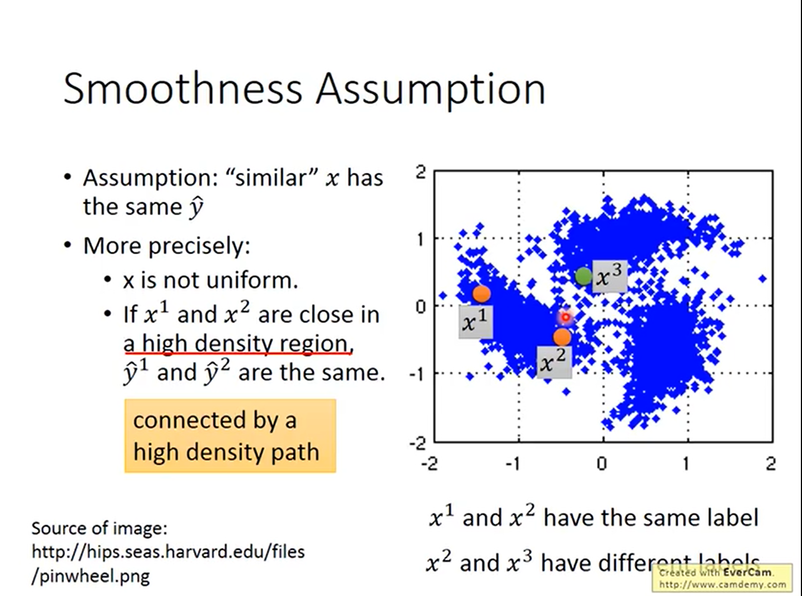

#### Why？

为什么会有这样的假设呢？

考虑手写数字识别的例子，我们看 图1和图2 的相似度可能不如 图2和图3，但是图1和图2中间有很多连续的变化形态。

人脸辨识也是，人的左脸和右脸可能相似度很低（因为一左一右），但是我们有足够多的unlabeled data的话，我们可以拼凑出一个人转脸的过程。

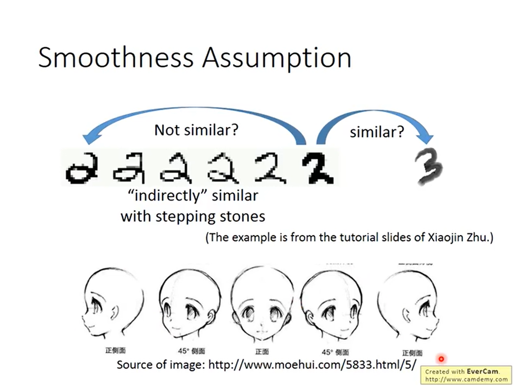

在文件分类上，假设我们需要分类天文学和旅游文章。如果unlabeled data和labelled data有overlap时，我们很容易区分。但是实际上因为word很多，重复的比例实际上是很低的，甚至有可能都没有任何overlap，但是如果我们connect到足够多的labelled data的话，我们可以区分出。

#### Cluster and Then label

我们先对 所有的data进行cluster,  然后统计每个cluster中每个label的数量。

不一定有用。work的假设是分布的区分性很强。我们需要先使用 Deep auto-encoder 抽取  feature再做。

####  Graph-based  Approch

> How to know $x^1$ and  $x^2$ close in high density region

我们可以把data表示成graph，比如像 Hyperlink of webpages

Graph的好坏会决定结果的好坏

* 定义两个 (xi, xj) 的相似度。一般需要使用auto-encoder的结果来算相似度

* Add Edge

  K-Nearst Neighbor ：最近的k个

  e-Neighborhood ：相似度超过一个阈值的

* Edge weight 正比于相似度

**如何定义相似度?**

Gaussian Radial Basis Function

使用 exp能够放大差距，只有很近的时候相似度才高

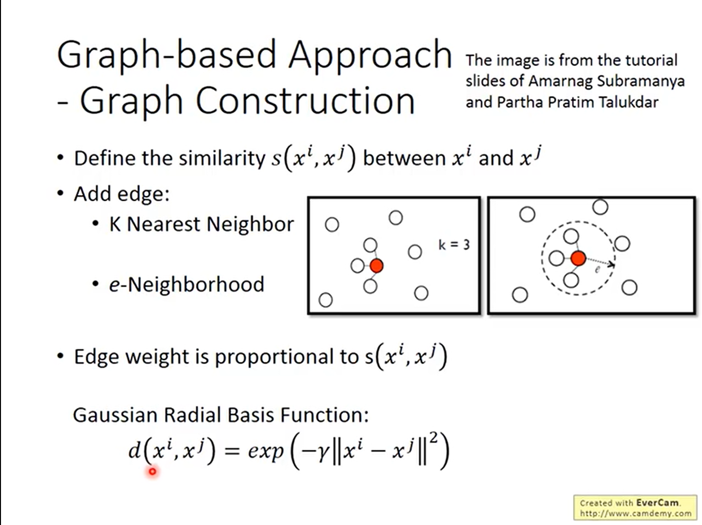

**How works?**

每一笔labelled data都会影响它的邻居，但是只影响邻居并没有利用graph。

真正tricky的地方是，相似度是会传递的。

同时一个critical的地方在于，数据要够多，否则就连不起来

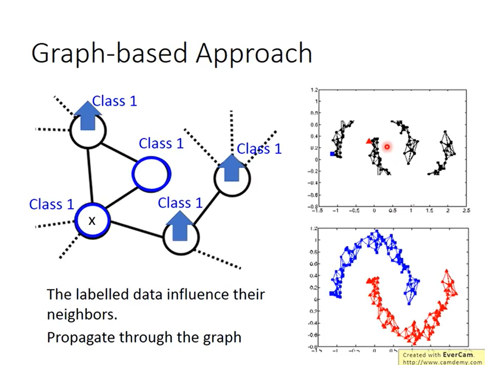

​	**如何定量使用**

> 定义label的smoothness

假设例子如图，每个edge有一个weight，对每张图定义一个smoothness

$S = \frac{1}{2} \sum_{i,j} (y^i - y^j)^2$

越小越smooth

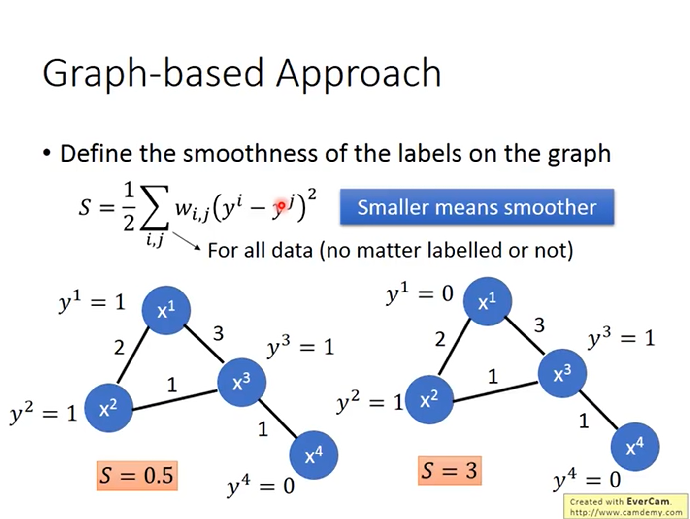

​		可以用矩阵的形式来表达 S

​	 	**拉普拉斯矩阵 L = Degree - W** : 	$S = y^T Ly$

​					Smoothness是一个取决于network parameter的值，衡量了label之间的smoothness

因此我们重新定义我们的 Loss Function

$L = \sum_{x^r}C(y^r, \hat y^r) + \lambda S$

**smoothness不一定需要放在output的地方，实际上可以放在network的任何地方**

### Better Representation

> 去芜存菁，世界背后有更简单的东西在操纵

见unsupervised Learning

