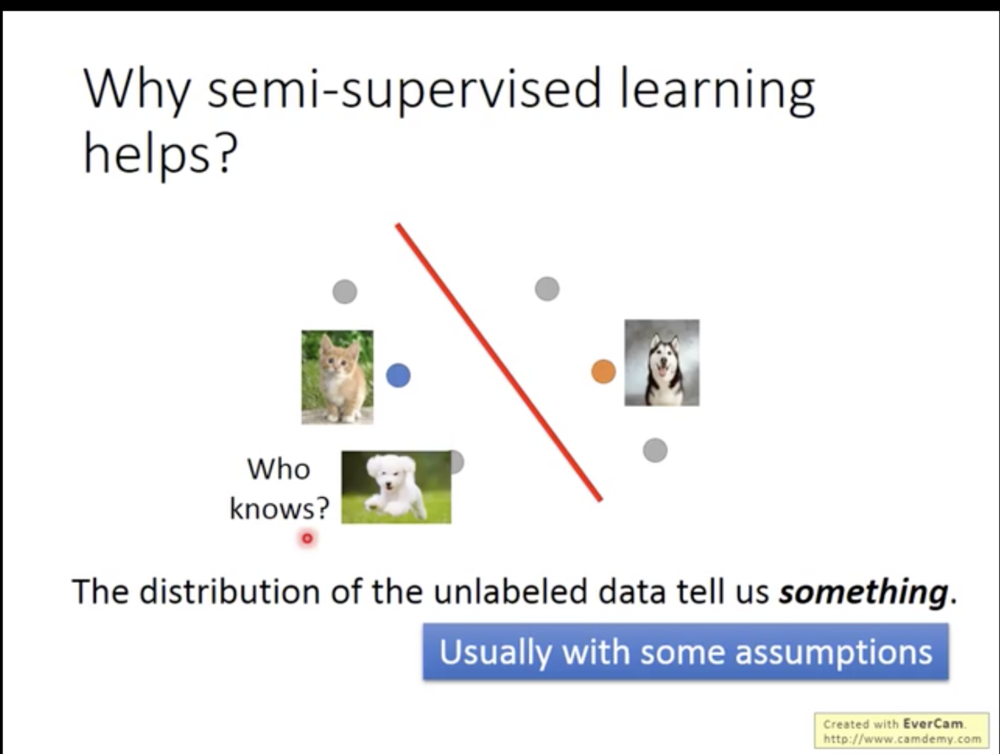

## Semi-supervised

> 半监督学习(semi-supervised learning)
> 1、introduction
> 2、Semi-supervised Learning for Generative Model
> 3、Low-density Separation Assumption：非黑即白
> 4、Smoothness Assumption：近朱者赤，近墨者黑
> 5、Better Representation：去芜存菁，化繁为简

### Introduction

**Supervised和Semi-supervised的区别**

Supervised Learning : $\left\{ (x^r, \hat y^r) \right\}_{r=1}^R$

* E.g $x^r$ : image, $\hat y^r$ : class labels

Semi-supervised Learning : $\left\{ (x^r, \hat y^r) \right\}_{r=1}^R$ , 还有一组 $\{x^u\}_{u=R}^{R+U}$

* training data中，部分data没有标签，只有input $x^u$ 

* 通常情况下，无标签的数据远大于有标签的数据 **U >> R**

* 分为两种：Transductive Learning 和 Inductive Learning

  * Transductive Learning ：将test data当作unlabeled data

    适用于已知test data的情况。

    这里仅仅使用了 test data的 **feature** 而不是 **label**, 因此不算cheating

  * Inductive Learning ：不将 test data当作 unlabeled data

    在train的时候并不知道test data长什么样。

  **使用哪种取决于test data是否已知**

  

### Why Semi-Supervised Learning Helps?

>  有人常会说我们没有data，但是我们缺的只是有label的data. E.g  image我们可以轻易获得，但是给image
>
> 作标签才是难得

我们人类实际上也是一直在做supervised learning。小孩被父母告知一只是狗，后面一直动物是猫是狗就是他自己学习的。

**Why helps？**

> Unlabeled Data 虽然没有label，但他们的distribution会告诉我们一些事

semi-supervised learning使用unlabled data时往往伴随着一些假设，而半监督学习的效果就取决于assumption是否符合实际情况

我们凭直觉觉得猫下面的那个应该是猫，但是也可能是个狗，谁知道呢？

#### Semi-supervised Learning for Generative Model

##### Supervised Generative Model

事实上，在监督学习中，我们已经讨论过概率生成模型了，假设class1和class2的分布分别为$mean_1=u^1,covariance_1=\Sigma$、$mean_2=u^2,covariance_2=\Sigma$的高斯分布，计算出Prior Probability后，再根据贝叶斯公式可以推得新生成的x所属的类别

