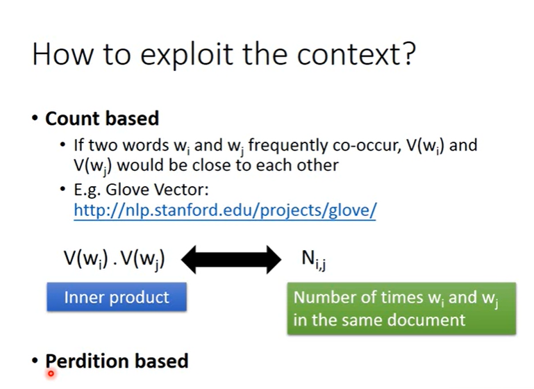

## Unsupervised Learning

### 1-of-N Encoding

比如我们有5个word，我们可以使用一个1x5的 bool vector来代表每个word. 但是这样我们没有办法知道两个word之间的联系，比如这里 dog和cat都属于动物，但是并没有发现他们之间的联系

**Word Class**

我们将不同类型的word分类，但是光做cluster是不够的，比如dog和apple都属于生物，但是并没有产生联系

<\center>

### Word Embedding

> 把每一个word都投影都一个high dimension的空间上，但是这个 dimension 是远小于 1-of-N Encoding小的。我们希望有相关联语义的词在这些dimension上是比较靠近的。同时我们可以知道不同的dimension是拿来区分什么的

**How works?**

这是一个Unsupervised Problem，Input是一个词汇，output是这个词汇的vector

<\center>

之前我们学过 Auto-encoder来进行 dimension reduction。

**这里不能使用auto-encoder 因为我们把 1-of-N vector丢入auto-encoder 无法学出任何Informative的东西**

我们真正想要知道一个词汇的meaning， 我们需要知道一个词汇的context, 可以根据上下文得到。

假设这里有两句话如图，我们发现马和蔡后面有相同的文字，因此这两个词就有相同的东西。

<\center>

#### Conut based

* 如果我们有两个词汇 $w_i$ 和  $w_j$ 经常一起出现， $V(w_i)$  和 $V(w_j)$ 就会比较接近

假设我们有 V(wi) 和 V(wj)， 我们可以计算他们的 inner product

而 $N_{i,j}$ 代表了 wi 和 wj 在同一个document的次数

**我们希望 $V(w_i) * V(w_j)$ 和 $N_{i.j}$ 越接近越好**

<\center>

#### Prediction Based

我们此处做的不是统计次数，而是根据 $w_i$ 预测 $w_{i+1}$

* 我们对每个 word 进行 1-of-N encoding, output是下一个word的几率

* 我们将第一个 hidden layer的output当作这个input的vector

<\center>

##### Why Works？

哪里体现了上下文之间的联系呢？

再次拿 马和蔡 的例子，我们希望 input 马和蔡的时候，output为宣誓就职的概率要高，但是为了要让output相似，中间的hidden layer自然而然就会比较相似。因此 hidden layer的output可以体现context

<\center>

**拓展**

我们可以进行拓展，input是 $w_{i-N} .. w_{i-1}$  预测 $w_i$

但是一般 N > 10 时才能训练出比较好的model

##### Sharing parameters

**实际上我们做的时候，我们希望 $w_{i-2}$ 和 $w_{i-1}$ 的 同一个维度的weight是一样的**

* 因为如果我们不这么做，我们把 i-2 和 i-1 交换顺序得到的结果就是不一样的。 (实际上我认为就应该是不一样的)

* 同时可以减少参数量

<\center>

用公式来表示就是如图

<\center>

此时我们得到的 word embedding 的结果就是z

**如何保证w是一样的**

1. 给 $w_i$ 和 $w_j$ 一样的初始值

2. 计算梯度更新 $w_i$ 和 $w_j $
   $$
   w_i \leftarrow w_i - \eta\frac{\partial C}{\partial w_i} - \eta\frac{\partial C}{\partial w_j}\\
   w_j \leftarrow w_j - \eta\frac{\partial C}{\partial w_i} - \eta\frac{\partial C}{\partial w_j}\\
   $$

##### training

**基础版**

计算 predict和true的 cross entropy作为loss

<\center>

##### Various Architecture

**Continuous bag of word (CBOW)**

我们使用 $w_{i-1}$ 和 $w_{i+1}$ 来predict  $w_i$

**Skip-gram**

我们使用 $w_{i-1}$  来predict  $w_{i-1}$ 和 $w_{i+1}$

<\center>

####  Other use

> word embedding 的 difference 也包含了很多信息

比如这里 hotter和 hot 的diff，与bigger和big 的diff很相近

比如想要解决 Rome: Italy, 求解 Berlin : ?

我们就有 $V(Germany) \approx V(Berlin) - V(Rome) + V(Italy) $ 推断 

<\center>

**翻译**

我们如果使用之前的方法，会发现中英文完全不会在一起，因为是根据上下文训练的，中英文不会连接在一起。

但是我们可以找出中英文一一对应的pair，然后想要使得project落在相似的位置

**image embedding**

将图片进行embedding

**Document embedding**

我们可以将一个document变成bag of word，然后使用auto-encoder

但是单词的顺序是很重要的，使用bag会失去很多information，具体的见reference

<\center>
